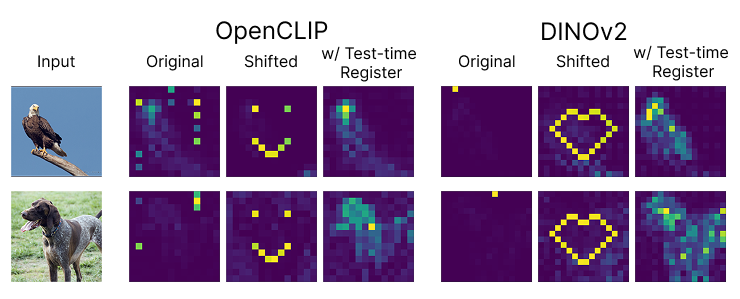

# Vision Transformers Don't Need <em>Trained</em> Registers

[Nick Jiang](https://nickjiang.me)\*, [Amil Dravid](https://avdravid.github.io/)\*, [Alexei A. Efros](https://people.eecs.berkeley.edu/~efros/), [Yossi Gandelsman](https://yossigandelsman.github.io/)

[Paper](https://arxiv.org/abs/2506.08010) | [Project Page](https://avdravid.github.io/test-time-registers/)



**Controlling high-norm tokens in Vision Transformers.** As shown in [Darcet et al. (2024)](https://arxiv.org/abs/2309.16588), high-norm outlier tokens emerge in ViTs and lead to noisy attention maps (“Original”). By identifying the mechanism responsible for their emergence, we demonstrate that we can shift them to arbitrary positions at test time (“Shifted”). Shifting the outlier tokens outside of the image area mimics register behavior at test-time (“w/ Test-time Register”), resulting in more interpretable attention patterns and downstream performance comparable to models retrained with registers.

## Ready-to-Use Models with Test-Time Registers 🤗

**Please consider starring ⭐ if you find this repository useful.**

We provide OpenCLIP models and LLaVA Llama-3 8B on HuggingFace that include precomputed register neurons and test-time registers. Please visit the links below and take a look `openclip_example.ipynb` and `llava_demo` for example usage. Note that LLaVa will need transformers==4.37.0. These models can be further fine-tuned or used for other downstream applications. 
<table style="margin: auto">
  <thead>
    <tr>
      <th>Model</th>
      <th style="text-align: center">🤗 Link</th>
    </tr>
  </thead>
  <tbody>
    <tr>
      <td>OpenCLIP ViT-B/16 with test-time register</td>
      <td style="text-align: center">
        <a href="https://huggingface.co/amildravid4292/clip-vitb16-test-time-registers">Link</a>
      </td>
    </tr>
    <tr>
      <td>OpenCLIP ViT-L/14 with test-time register</td>
      <td style="text-align: center">
        <a href="https://huggingface.co/amildravid4292/clip-vitl14-test-time-registers">Link</a>
      </td>
    </tr>
    <tr>
      <td>LLaVA Llama-3 8B with test-time register</td>
      <td style="text-align: center">
        <a href="https://huggingface.co/amildravid4292/llava-llama-3-8b-test-time-registers">Link</a>
      </td>
    </tr>
  </tbody>
</table>

To access DINOv2 with test-time registers on its own, load the model directly from PyTorch Hub. See an example in `dinov2_example.ipynb`.
```
import torch
model = torch.hub.load("nickjiang2378/test-time-registers", model = "dinov2_vitl14_tt_reg")
```

## Repo Setup

### Repo
```
git clone git@github.com:nickjiang2378/test-time-registers.git
cd test-time-registers
```

### Environment

```
conda env create -f environment.yml
```

## Repo Overview
```
test-time-registers/
├── clip/
│   ├── ...
│   ├── clip_hook_manager.py
│   └── clip_state.py
├── dinov2/
│   ├── ...
│   ├── dinov2_hook_manager.py
│   └── dinov2_state.py
└── shared/
    ├── ...
    ├── algorithms.py
    ├── hook_manager.py
    └── hook_fn.py
```
Here are the most important files in this repo:

`hook_manager.py`: manages all hooks (interventions, logging) registered for the model. `CLIPHookManager` and `Dinov2HookManager` are both subclasses.

`hook_fn.py`: contains the hook functions for intervening on register neurons and logging model internals for analysis

`algorithms.py`: contains algorithm for detecting register neurons

`clip_state.py` / `dinov2_state.py`: loads model, instantiates hook manager, and passes important metadata like number of layers

## Repo Usage

See `register_neurons.ipynb` to automatically find register neurons and analyze the effects of intervening upon them with test-time registers.

### ImageNet

Many sections rely on access to a corpus of images for use in analysis; our paper uses [ImageNet 2012](https://www.image-net.org/challenges/LSVRC/index.php). You can also create a folder of custom images, but the folder should only consist of images (ie. JPEGs). Once collected or downloaded, pass the folder path to the `IMAGENET_PATH` variable in the notebook.

### Adding New Models

To study ViTs beyond CLIP and DINOv2, we recommend creating a new environment to avoid dependency conflicts with DINOv2 and CLIP. Copy the new model's code into this repo (similar to what's done with CLIP and DINOv2), and create two additional files in the new model's folder:
1. `custom_hook_manager.py`: initialize a subclass of the `HookManager` class in `shared/hook_manager.py` and fill out the abstract methods, which tell us how to hook into important model components like the MLP, attention heads, etc. See `dinov2/dinov2_hook_manager.py` for an example.
2. `custom_state.py`: create a `load_model_state` function that loads in a model based on a config (to specify size, etc.), instantiates the hook manager, and returns metadata like number of layers. See `dinov2/dinov2_state.py` for an example.

Lastly, you should modify the model code to enable adding in extra tokens initialized to zeros. This is necessary for creating our "test-time" registers to shift outliers from the image to. In CLIP, we pass in the number of registers during the forward pass. In DINOv2, we set this number as an attribute of the model class. See their respective folders for more details.

### Hook Manager

The hook manager provides access to model internals such as neuron activations, layer outputs, and attention maps. It can also perform interventions such as ablating register neurons or applying functions to layer outputs.

#### Usage
```
# Declare the hook manager
hook_manager = HookManager(model)

# Reinitialize logged values and hooks
hook_manager.reinit(mode = HookMode.ANALYSIS)

# Add any intervention hooks
hook_manager.intervene_register_neurons(...)

# Finalize hooks - this step actually registers all the hooks in the model
hook_manager.finalize()

# Call the model
run_model(...)

# Access model internals
hook_manager.get_neuron_activations(), etc.
```

#### Main methods

For a full list of methods, check out `shared/hook_manager.py`.

##### `reinit(mode: HookType)`
Resets saved model internals and removes previous hooks. The `mode` parameter controls which model internals are logged:

- `HookMode.ANALYSIS`: Logs comprehensive model internals including:
  - Neuron activations
  - Layer outputs
  - Attention maps (both pre and post-softmax)
- `HookMode.INTERVENE`: No logging - only registers intervention hooks if specified

Note: More hooks = slower forward passes.

##### `intervene_register_neurons(num_registers: int, neurons_to_ablate: dict, scale: float = 1.0, normal_values: str = "zero")`
Registers an intervention on specified neurons. Parameters:

- `num_registers`: Number of registers used by the model
- `neurons_to_ablate`: Dictionary mapping layers to lists of neurons
- `scale`: Multiplier for max activation on test-time register (default: 1.0)
- `normal_values`: Strategy for modifying image patches:
  - `"zero"`: Set to zero
  - `"mean"`: Set to mean activation
  - `"only_outliers"`: Only modify outlier activations
  - `"same"`: Keep original values

##### `finalize()`
Registers all intervention and logging hooks. Log hooks are registered after interventions, so logged internals will reflect any changes made by interventions.


## Evaluation
Test-time registers and register neurons are native to the OpenCLIP HuggingFace models above, so we recommend using those versions for evaluating OpenCLIP (see `openclip_example.ipynb`). For DINOv2, we provide access to a model integrated with test-time registers via torch hub (see `dinov2_example.ipynb`). Below we provide the instructions on how to reproduce results from our paper. We use the default hyperparameters provided by these repos unless none are defined.

**DINOv2 IN-1k Linear Probe (Tables 1,2):** We use the original [DINOv2 repo](https://github.com/facebookresearch/dinov2) which already provides the set of hyperparameters.

**OpenCLIP IN-1k Linear Probe (Table 2):** We use the linear probing code from [here](https://github.com/mlfoundations/wise-ft) with a learning rate of 0.01 for 10 epochs.

**ADE20k Segmentation and NYUv2 Depth Estimation Linear Probe (Table 2):** Add the models [here](https://github.com/Jiawei-Yang/Denoising-ViT), which already provides the set of hyperparameters for both experiments.

**OpenCLIP Zero-Shot ImageNet Classification (Table 3):** We follow the standard zero-shot protocol in [here](https://github.com/openai/CLIP). An example can also be found in `openclip_demo.ipynb`.

**Imagenet Zero-Shot Segmentation (Table 4):** We use this [repo](https://github.com/yossigandelsman/clip_text_span) for evaluation of ImageNet zero-shot segmentation.

**LOST Unsupervised Object Discovery (Table 5):** We use the official [LOST repo](https://github.com/valeoai/LOST). We sweep over the last four layers of both OpenCLIP and DINOv2. For OpenCLIP, we use the value projection features, and for DINOv2, we the use the key features. We find that normalizing the features before LOST computation can improve results for all methods. Finally, following [Darcet et al. (2024)](https://arxiv.org/abs/2309.16588), we sweep over a manual bias term for the affinity matrix. For normalized features, sweep over [-1, 0].


## Citation
Please cite our paper as:
```
@inproceedings{jiangvision,
  title={Vision Transformers Don't Need Trained Registers},
  author={Jiang, Nick and Dravid, Amil and Efros, Alexei A and Gandelsman, Yossi},
  booktitle={arXiv preprint arXiv:2506.08010},
  year={2025}
}
